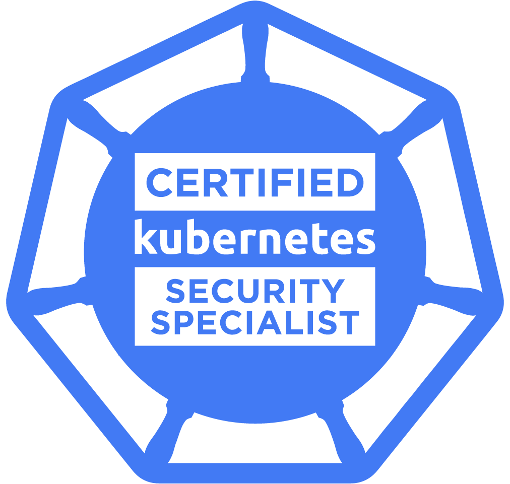

  

  
  
  
  
  
  
  

# Certified Kubernetes Security Specialist - CKSS
This repository is a collection of resources to prepare for the Certified Kubernetes Security Specialist (CKSS) exam.
> The given references and links below are just assumptions and ideas around the [CKSS curriculum](https://github.com/cncf/curriculum/blob/master/CKS_Curriculum_%20v1.19%20Coming%20Soon%20November%202020.pdf).
## Coming in November
Earlier this year CNCF announced an upcoming new Certified Kubernetes Security Specialist (CKS) Certification Exam, This new certification is for those who **have passed the CKA** exam and want third party validation for their working knowledge of container security.

From the [announcement](https://www.cncf.io/blog/2020/07/15/certified-kubernetes-security-specialist-cks-coming-in-november/) of the CNCF the CKS is described as:
> CKS is similar in format to CKA and will consist of a performance-based certification exam – testing competence across best practices for securing container-based applications and Kubernetes platforms during build, deployment, and runtime.

> The certification is expected to be generally available before the KubeCon + CloudNativeCon North America Virtual event taking place November 17-20.

## CKS Outline
The CKS test will be online, proctored and performance-based, and candidates have 2 hours to complete the exam tasks.

From the CKS Exam Curriculum repository, The exam will test domains and competencies including:
1. **Cluster Setup (10%)**: Best practice configuration to control the environment's access, rights and platform conformity.
2. **Cluster Hardening (15%)**: Protecting K8s API and utilize RBAC.
3. **System Hardening (15%)**: Improve the security of OS & Network; restrict access through IAM
4. **Minimize Microservice Vulnerabilities (20%)**: Utilizing on K8s various mechanisms to isolate, protect and control workload.
5. **Supply Chain Security (20%)**: Container oriented security, trusted resources, optimized container images, CVE scanning.
6. **Monitoring, Logging, and Runtime Security (20%)**: Analyse and detect threads.

# CKS Exam Preparation
In order to take the CKS exam, you must have **Valid CKA certification** to demonstrate you possess sufficient Kubernetes expertise.
A first good starting point for securing Kubernetes is the Task section [**Securing a Cluster**](https://kubernetes.io/docs/tasks/administer-cluster/securing-a-cluster/) of the official K8s documentation.

## Cluster Setup (10%)

Use Network security policies to restrict cluster level access

  
* [Network Policies](https://kubernetes.io/docs/concepts/services-networking/network-policies)
* [Securing a Cluster](https://kubernetes.io/docs/tasks/administer-cluster/securing-a-cluster/)
* [Declare Network Policy](https://kubernetes.io/docs/tasks/administer-cluster/declare-network-policy/)
* [Enforcing Network Policies in Kubernetes](https://kubernetes.io/blog/2017/10/enforcing-network-policies-in-kubernetes/)
* [Get started with Kubernetes network policy](https://docs.projectcalico.org/security/kubernetes-network-policy)
* [kubernetes-network-policy-recipes](https://github.com/ahmetb/kubernetes-network-policy-recipes)
* [Kubernetes Network Policies Best Practices](https://blog.alcide.io/kubernetes-network-policies-best-practices)
* [Exploring Network Policies in Kubernetes](https://banzaicloud.com/blog/network-policy/)

Use CIS benchmark to review the security configuration of Kubernetes components (etcd, kubelet, kubedns, kubeapi)

  
* [CIS benchmark for Kubernetes](https://www.cisecurity.org/benchmark/kubernetes/)
  * The benchmark is not yet available for `Kubernetes 1.19`, but it gives great understanding.
* [What is Center for Internet Security (CIS) Benchmarks](https://docs.microsoft.com/en-us/microsoft-365/compliance/offering-cis-benchmark)
* [Kube-bench](https://github.com/aquasecurity/kube-bench#running-kube-bench): A tool for running Kubernetes CIS Benchmark tests
* [GKE: CIS Benchmarks for etcd & kubelet](https://cloud.google.com/kubernetes-engine/docs/concepts/cis-benchmarks#default-values) 

Properly set up Ingress objects with security control

  
* [Ingress](https://kubernetes.io/docs/concepts/services-networking/ingress/)
* [Ingress Controllers](https://kubernetes.io/docs/concepts/services-networking/ingress-controllers/)
* [Set up Ingress on Minikube with the NGINX Ingress Controller](https://kubernetes.io/docs/tasks/access-application-cluster/ingress-minikube/)
* [secure an Ingress by specifying a Secret that contains a TLS private key and certificate](https://kubernetes.io/docs/concepts/services-networking/ingress/#tls) 

Protect node metadata and endpoints

  
* [Restricting cloud metadata API access](https://kubernetes.io/docs/tasks/administer-cluster/securing-a-cluster/#restricting-cloud-metadata-api-access)
* [Setting up secure endpoints in Kubernetes](https://blog.cloud66.com/setting-up-secure-endpoints-in-kubernetes/)
* [GKE Protecting cluster metadata](https://cloud.google.com/kubernetes-engine/docs/how-to/protecting-cluster-metadata)
* [Retrieving EC2 instance metadata](https://docs.aws.amazon.com/AWSEC2/latest/UserGuide/instancedata-data-retrieval.html)
* [EC2 Instance user data](https://docs.aws.amazon.com/AWSEC2/latest/UserGuide/ec2-instance-metadata.html) 

Minimize use of, and access to, GUI elements

  
* [Web-based Kubernetes User Interface](https://kubernetes.io/docs/tasks/access-application-cluster/web-ui-dashboard/)
* [On Securing the Kubernetes Dashboard](https://blog.heptio.com/on-securing-the-kubernetes-dashboard-16b09b1b7aca)

Verify platform binaries before deploying

  
* [Kubernetes platform binaries](https://github.com/kubernetes/kubernetes/releases)

## Cluster Hardening (15%)

Restrict access to Kubernetes API

* [Controlling Access to the Kubernetes API](https://kubernetes.io/docs/reference/access-authn-authz/controlling-access/)
* [GKE: Hardening your cluster's security](https://cloud.google.com/anthos/gke/docs/on-prem/how-to/hardening-your-cluster)

Use Role Based Access Controls to minimize exposure

* [Using RBAC Authorization](https://kubernetes.io/docs/reference/access-authn-authz/rbac/)
* [Authorization modes for Kubernetes API server](https://kubernetes.io/docs/reference/access-authn-authz/authorization/#authorization-modules)
* [Understand Role-Based Access Control in Kubernetes](https://www.youtube.com/watch?v=G3R24JSlGjY)

Exercise caution in using service accounts e.g. disable defaults, minimize permissions on newly created ones

  
* [Managing Service Accounts](https://kubernetes.io/docs/reference/access-authn-authz/service-accounts-admin/)
* [Kubernetes: Creating Service Accounts and Kubeconfigs](https://docs.armory.io/docs/armory-admin/manual-service-account/)
* [Kubernetes Access Control: Exploring Service Accounts](https://thenewstack.io/kubernetes-access-control-exploring-service-accounts/)
* [Disable default service account by deployments in Kubernetes](https://stackoverflow.com/questions/52583497/how-to-disable-the-use-of-a-default-service-account-by-a-statefulset-deployments)
* [Configure Service Accounts for Pods](https://kubernetes.io/docs/tasks/configure-pod-container/configure-service-account/)
* [Kubernetes should not mount default service account credentials by default](https://github.com/kubernetes/kubernetes/issues/57601)
* [Securing Kubernetes Clusters by Eliminating Risky Permissions](https://www.cyberark.com/resources/threat-research-blog/securing-kubernetes-clusters-by-eliminating-risky-permissions)

## System Hardening (15%)

Minimize host OS footprint (reduce attack surface)

* [Reduce Kubernetes Attack Surfaces](https://blog.sonatype.com/kubesecops-kubernetes-security-practices-you-should-follow#:~:text=Reduce%20Kubernetes%20Attack%20Surfaces)
* [distribution independent linux](https://www.cisecurity.org/benchmark/distribution_independent_linux/)
* [CIS Benchmark Ubuntu Linux](https://www.cisecurity.org/benchmark/ubuntu_linux/)
* [CIS Benchmark RedHat](https://www.cisecurity.org/benchmark/red_hat_linux/)
* [CIS Benchmark Debian](https://www.cisecurity.org/benchmark/debian_linux/)
* [CIS Benchmark Centos](https://www.cisecurity.org/benchmark/centos_linux/)
* [CIS Benchmark SUSE](https://www.cisecurity.org/benchmark/suse_linux/)
* [CIS Benchmark Oracle](https://www.cisecurity.org/benchmark/oracle_linux/)

Minimize IAM roles

* [What is the Principle of Least Privilege (POLP)?](https://digitalguardian.com/blog/what-principle-least-privilege-polp-best-practice-information-security-and-compliance)
* [IAM Grant least privilege](https://docs.aws.amazon.com/IAM/latest/UserGuide/best-practices.html#grant-least-privilege)

Minimize external access to the network

* [Secure hosts with OS-level firewall (ufw)](https://help.replicated.com/community/t/managing-firewalls-with-ufw-on-kubernetes/230)
* [Configure firewall with ufw](https://www.linode.com/docs/security/firewalls/configure-firewall-with-ufw/)
* [Use security groups to secure network (Azure)](https://docs.microsoft.com/en-us/azure/aks/concepts-security#azure-network-security-groups)
* [Amazon EKS security group considerations](https://docs.aws.amazon.com/eks/latest/userguide/sec-group-reqs.html)
* [Amazon EC2 security groups for Linux instances](https://docs.aws.amazon.com/AWSEC2/latest/UserGuide/ec2-security-groups.html)

Appropriately use kernel hardening tools such as AppArmor, seccomp

* [Kubernetes Hardening Best Practices](https://www.sumologic.com/kubernetes/security/#security-best-practices)
* [Restrict a Container's Syscalls with Seccomp](https://kubernetes.io/docs/tutorials/clusters/seccomp/)
* [Restrict a Container's Access to Resources with AppArmor](https://kubernetes.io/docs/tutorials/clusters/apparmor/)
* [Container Security: Fundamental Technology Concepts that Protect Containerized Application by Liz Rice](https://cdn2.hubspot.net/hubfs/1665891/Assets/Container%20Security%20by%20Liz%20Rice%20-%20OReilly%20Apr%202020.pdf)

## Minimize Microservice Vulnerabilities (20%)

Setup appropriate OS level security domains e.g. using PSP, OPA, security contexts

* [Pod Security Policies](https://kubernetes.io/docs/concepts/policy/pod-security-policy/)
* [Configure a Security Context for a Pod or Container](https://kubernetes.io/docs/tasks/configure-pod-container/security-context/)
* [Open Policy Agent Introduction](https://www.youtube.com/watch?v=Yup1FUc2Qn0)
* [OPA Gatekeeper: Policy and Governance for Kubernetes](https://kubernetes.io/blog/2019/08/06/opa-gatekeeper-policy-and-governance-for-kubernetes/)
* [Enforce policies on Kubernetes objects with OPA](https://www.openpolicyagent.org/docs/v0.12.2/kubernetes-admission-control/)
* [Pod Security Policy](https://blog.alcide.io/pod-security-policy)
* [katacoda lab around Secrets](https://www.katacoda.com/courses/kubernetes/managing-secrets)

Manage kubernetes secrets

* [Kubernetes Secrets](https://kubernetes.io/docs/concepts/configuration/secret/)
* [Managing Secrets in Kubernetes](https://www.weave.works/blog/managing-secrets-in-kubernetes)
* [Secrets Store CSI driver](https://github.com/kubernetes-sigs/secrets-store-csi-driver)

Use container runtime sandboxes in multi-tenant environments (e.g. gvisor, kata containers)

* [What is gVisor?](https://gvisor.dev/docs/)
* [Use gVisor to run Kubernetes pods](https://gvisor.dev/docs/user_guide/quick_start/kubernetes/)
* [Implementing secure Containers using Google’s gVisor](https://thenewstack.io/how-to-implement-secure-containers-using-googles-gvisor/)
* [Kata containers and Kubernetes: How they fit together?](https://platform9.com/blog/kata-containers-docker-and-kubernetes-how-they-all-fit-together/)
* [How to use Kata Containers with Kubernetes?](https://github.com/kata-containers/documentation/blob/master/how-to/how-to-use-k8s-with-cri-containerd-and-kata.md)

Implement pod to pod encryption by use of mTLS

  
* [Manage TLS Certificates in a Cluster](https://kubernetes.io/docs/tasks/tls/managing-tls-in-a-cluster/)
* [Secure communication between services in Istio with mutual TLS](https://developer.ibm.com/technologies/containers/tutorials/istio-security-mtls/)
* [Mutual TLS Authentication (mTLS) De-Mystified](https://codeburst.io/mutual-tls-authentication-mtls-de-mystified-11fa2a52e9cf)
* [Traffic encryption using mTLS](https://www.istioworkshop.io/11-security/01-mtls/)
* [Using Istio to improve end-to-end security](https://istio.io/latest/blog/2017/0.1-auth/)
* [Linerd: automatic mtls](https://linkerd.io/2/features/automatic-mtls/)

## Supply Chain Security (20%)

Minimize base image footprint

* [Why build small container images in Kubernetes](https://cloud.google.com/blog/products/gcp/kubernetes-best-practices-how-and-why-to-build-small-container-images)
* [Use the smallest base image possible](https://cloud.google.com/solutions/best-practices-for-building-containers#build-the-smallest-image-possible)
* [7 best practices for building containers](https://cloud.google.com/blog/products/gcp/7-best-practices-for-building-containers)
* [distroless containers](https://github.com/GoogleContainerTools/distroless)
* [Docker multi-stage builds](https://docs.docker.com/develop/develop-images/multistage-build/)

Secure your supply chain: whitelist allowed image registries, sign and validate images

* [Using Admission Controllers](https://kubernetes.io/docs/reference/access-authn-authz/admission-controllers/)
* [Dynamic Admission Control](https://kubernetes.io/docs/reference/access-authn-authz/extensible-admission-controllers/)
* [A Guide to Kubernetes Admission Controllers](https://kubernetes.io/blog/2019/03/21/a-guide-to-kubernetes-admission-controllers/)
* [Content trust in Docker](https://docs.docker.com/engine/security/trust/content_trust/)
* [How to reject docker registries in Kubernetes?](https://stackoverflow.com/questions/54463125/how-to-reject-docker-registries-in-kubernetes)
* [Ensure images only from approved sources are run](https://github.com/kubernetes/kubernetes/issues/22888)
* [Restrict pulling images from Registry](https://www.openpolicyagent.org/docs/latest/kubernetes-primer/)
* [Container image signatures in Kubernetes](https://medium.com/sse-blog/container-image-signatures-in-kubernetes-19264ac5d8ce)

Use static analysis of user workloads (e.g. kubernetes resources, docker files)

* [Static analysis with Kube-score](https://kube-score.com/)
* [Kubernetes static code analysis with Checkov](https://bridgecrew.io/blog/kubernetes-static-code-analysis-with-checkov/)
* [Static analysis with Clair](https://github.com/quay/clair)

Scan images for known vulnerabilities

* [Scan your Docker images for vulnerabilities](https://medium.com/better-programming/scan-your-docker-images-for-vulnerabilities-81d37ae32cb3)
* [Scan your Docker containers for vulnerabilities with Clair](https://github.com/leahnp/clair-klar-kubernetes-demo)
* [OpenSCAP](https://github.com/OpenSCAP/openscap)
* [CLAIR](https://github.com/quay/clair)
* [Vuls](https://github.com/future-architect/vuls)

## Monitoring, Logging and Runtime Security (20%)

Perform behavioral analytics of syscall process and file activities at the host and container level to detect malicious activities

* [How to detect a Kubernetes vulnerability using Falco](https://sysdig.com/blog/how-to-detect-kubernetes-vulnerability-cve-2019-11246-using-falco/)
* [Kubernetes Security monitoring at scale](https://medium.com/@SkyscannerEng/kubernetes-security-monitoring-at-scale-with-sysdig-falco-a60cfdb0f67a)
* [Restrict a Container's Syscalls with Seccomp](https://kubernetes.io/docs/tutorials/clusters/seccomp/)

Detect threats within physical infrastructure, apps, networks, data, users and workloads

  
* [Common Kubernetes config security threats](https://www.cncf.io/blog/2020/08/07/common-kubernetes-config-security-threats/)
* [A guidance on Kubernetes threat modeling](https://www.trendmicro.com/vinfo/us/security/news/virtualization-and-cloud/guidance-on-kubernetes-threat-modeling)
* [Threat matrix for Kubernetes](https://www.microsoft.com/security/blog/2020/04/02/attack-matrix-kubernetes/)

Detect all phases of attack regardless where it occurs and how it spreads

* [Investigating Kubernetes attack scenarios in Threat Stack](https://www.threatstack.com/blog/kubernetes-attack-scenarios-part-1)
* [Anatomy of a Kubernetes attack – How untrusted Docker images fails us](https://www.optiv.com/explore-optiv-insights/source-zero/anatomy-kubernetes-attack-how-untrusted-docker-images-fail-us)

Perform deep analytical investigation and identification of bad actors within environment

* [Kubernetes security 101: Risks and Best practices](https://www.stackrox.com/post/2020/05/kubernetes-security-101/)

Ensure immutability of containers at runtime

* [Principles of Container-based Application Design](https://kubernetes.io/blog/2018/03/principles-of-container-app-design/)
* [Leverage Kubernetes to ensure that containers are immutable](https://access.redhat.com/documentation/en-us/red_hat_enterprise_linux_atomic_host/7/html/container_security_guide/keeping_containers_fresh_and_updateable#leveraging_kubernetes_and_openshift_to_ensure_that_containers_are_immutable)
* [Why I think we should all use immutable Docker images](https://medium.com/sroze/why-i-think-we-should-all-use-immutable-docker-images-9f4fdcb5212f)
* [With immutable infrastructure, your systems can rise from the dead](https://techbeacon.com/enterprise-it/immutable-infrastructure-your-systems-can-rise-dead)

Use Audit Logs to monitor access

* [Kubernetes Audit](https://kubernetes.io/docs/tasks/debug-application-cluster/audit/)
* [How to monitor Kubernetes audit logs?](https://www.datadoghq.com/blog/monitor-kubernetes-audit-logs/)
* [Kubernetes Audit logging](https://docs.sysdig.com/en/kubernetes-audit-logging.html)
* [Kubernetes Audit: Making Log Auditing a Viable Practice Again](https://blog.alcide.io/kubernetes-audit-making-log-auditing-a-viable-practice-again)

# Related Kubernetes security resources
* [Cloud Native Security Tutorial](https://tutorial.kubernetes-security.info/)
* [Killer Shell CKS Simulator](https://killer.sh/cks)
* [Sysdig Kubernetes Security Guide](https://sysdig.com/resources/ebooks/kubernetes-security-guide/)
* [Kubernetes Security Best Practices - Ian Lewis, Google](https://youtu.be/wqsUfvRyYpw)
* [Kubernetes security concepts and demos](https://youtu.be/VjlvS-qiz_U)
* [Tutorial: Getting Started With Cloud Native Security - Liz Rice, Aqua Security & Michael Hausenblas](https://youtu.be/MisS3wSds40)

# Keep Updating
* LIVING DOCUMENT - I WILL UPDATE IT FREQUENTLY WHEN I HAVE NEW INFORMATIONS
* PRs are always welcome so star, fork and contribute
  * please make a pull request if you would like to add or update 
# Stargazers over Time

Ibrahim Jelliti © 2020

